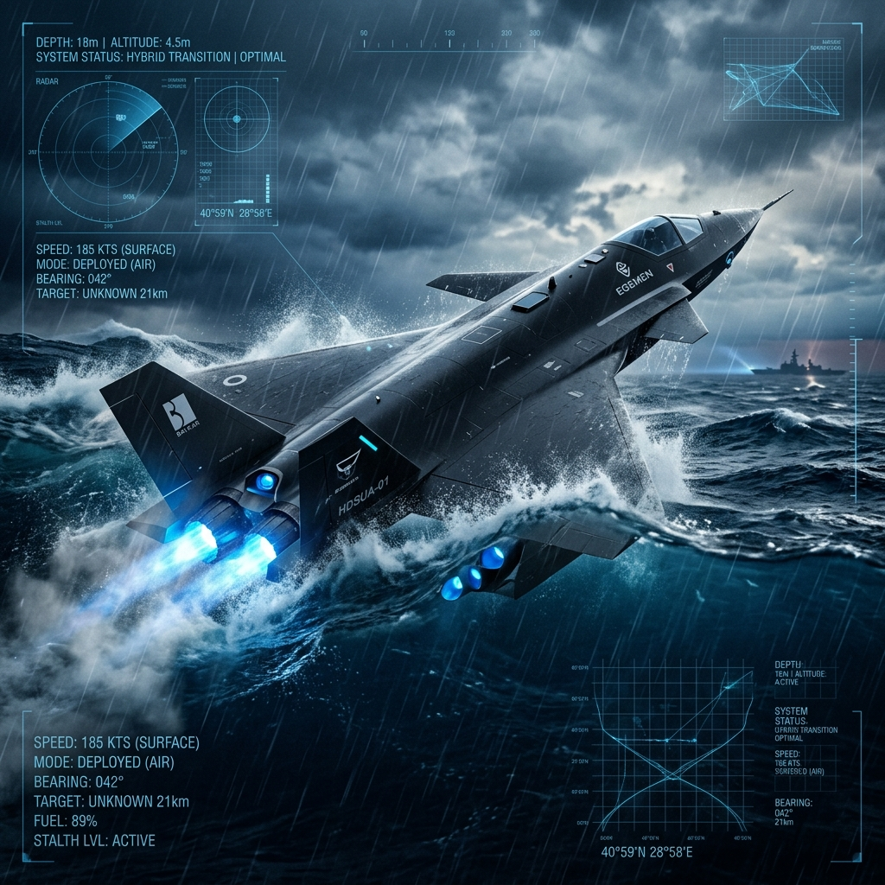

# 🔱 KIZILELMA-H: Egemen Hibrit Operasyonel Platform

## 🎯 Proje Vizyonu: Çift-Domain Egemenliği
KIZILELMA-H, havacılık ve denizaltı teknolojilerini tek bir gövdede birleştiren, Baykar Kızılelma mimarisinden ilham alan dünyanın ilk **Otonom Amfibi Savaş Platformu**'dur. Bu araç, stratosferden derin denizlere kadar kesintisiz operasyon kabiliyeti sunarak "Mavi Vatan" ve "Gök Vatan" savunmasını tek bir potada eritir.

---

## 🛠️ Teknik Spesifikasyonlar (Operational Parameters)

| Parametre | Hava Modu (Alpha) | Denizaltı Modu (Omega) |
| :--- | :--- | :--- |
| **İtki Sistemi** | Plazma Jet / Turbofan | Süperkavitasyon İtki Sistemi |
| **Maksimum Hız** | Mach 2.2 | 85 Knot (Sualtı) |
| **Operasyonel İrtifa/Derinlik** | 45.000 ft | -450 m |
| **Görünmezlik (Stealth)** | Aktif Radar Kesit Küçültme | Akustik Absorbe Eden Meta-Malzeme |
| **Otonomi Seviyesi** | Level 5 (Edge-AI) | Level 5 (Swarm Intelligence) |

---

## 🌀 Hibrit Geçiş Mekanizması (Transition Phase)
KIZILELMA-H, su yüzeyine temas anında kanat geometrisini ve motor girişlerini optimize ederek **"Hydro-Aero Dynamic Configuration"** moduna geçer.
1.  **Dalış Hazırlığı:** Kanatçıklar su direnci için optimize edilir, jet çıkışları su geçirmez süperkavitasyon kanallarına yönlendirilir.
2.  **Yüzeye Çıkış:** Güçlü plazma ateşleyiciler su altından çıkış anında anlık itki sağlayarak aracı saniyeler içinde uçuş hızına ulaştırır.

---

## 🛡️ Stratejik Avantajlar
- **Tespit Edilemezlik:** Gökyüzünde radar takibinden kaçan araç, denize dalarak sonar takibini de imkansız hale getirir.
- **Hızlı Yanıt:** Uzak denizlerdeki hedeflere uçak hızıyla gidip, operasyonu denizaltı gizliliğiyle yürütür.
- **Lojistik Esneklik:** Herhangi bir uçak gemisine ihtiyaç duymadan, herhangi bir kıyı şeridinden otonom olarak kalkış/dalış yapabilir.

---

> *"Geleceğin savaşları domainler arası geçişte kazanılacaktır. KIZILELMA-H, bu geçişin anahtarıdır."*

**Developed by arch-yunus | 2026 Sovereign Systems Initiative**
