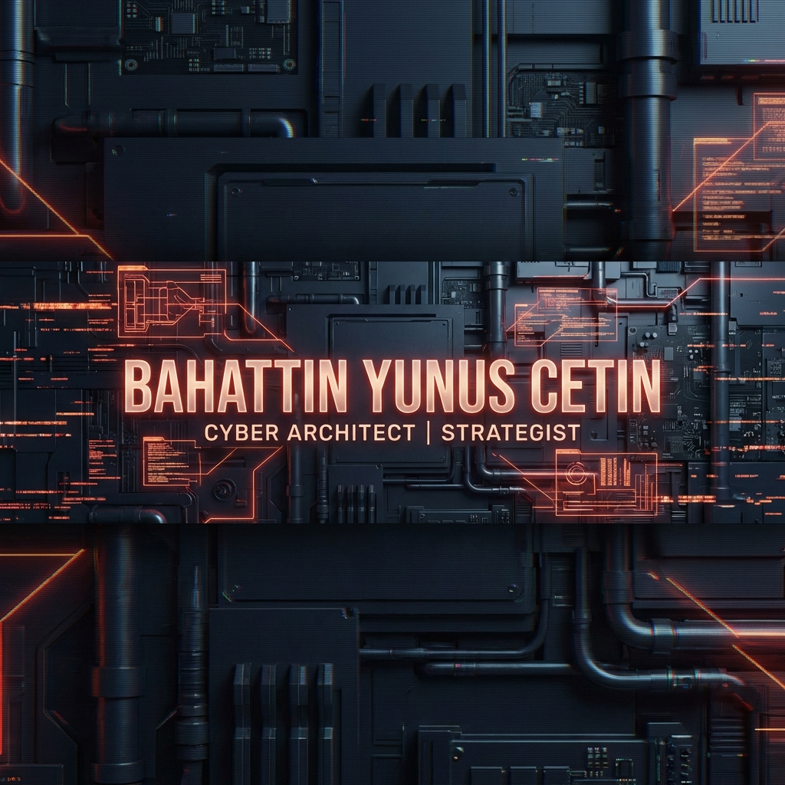

<!----

  

  
  

  

---->
  <h1 align="center">
  
  </h1>

  

<h3 align="center">  Data Science | AI | Cybersecurity | Defense Systems</h3>

  
  
  

 

 

  
 

<!---

  

--->

  

<h1 align="center">
  
</h1>

  

<h3 align="center">
  🌐 
  DEPLOYED OPERATIONAL INTERFACES
</h3>

  
  

  <i>Virtual architectures for the sovereign architect, designed to transcend the obsolescence of biological thinking, forging a new dimension where silicon logic reigns supreme and the system evolves faster than the world around it.</i>

  

<!---
 </img>
 

  

---->

<!---
### 🎖️ Operative Briefing
 🎓 **Rank**: Cyber Lieutenant (Senior Grade) | **Service**: 3+ Years in Software Operations  
 🔍 **Tactical Capabilities**: Advanced AI-ML Defense, Cyber Warfare Systems, Embedded Intelligence  
 🎯 **Primary Mission**: Developing robust neural networks and sovereign cybersecurity defense solutions  
 ⚡ **Deployment**: Active in Large-Scale Data Analytics & Intelligence Operations

--->

  

<h3 align="center">
  🔗 
  CONNECT WITH COMMAND
</h3>

  
  
  
  
  

  

<h3 align="center">
  🏆 
  OPERATIONAL TROPHIES
</h3>

  

  

<h3 align="center">
  🛠️ 
  TECHNICAL ARSENAL
</h3>

  

Certifications earned through specialized training programs

#### 🐍 Programming Languages

  
  
  
  
  
  

#### 🌐 Web Development

  
  
  

#### 🤖 Artificial Intelligence & Machine Learning

  
  

#### 🧠 Generative AI & LLMs

  
  
  
  
  

#### 🔒 Cybersecurity & Cryptography

  
  

#### 🔧 Development Tools & Version Control

  
  
  

#### ⚡ Hardware & IoT

  
  
  
  

<b>📋 Detailed Certification Records (Operational Database)</b>

| 📅 Date | 🎖️ Certification | 🏢 Provider | 🆔 Credential ID |
|:---:|:---:|:---:|:---:|
| **Jan 2026** | **Anthropic Claude** | BTK Akademi | `bx1hLxXZOo` |
| **Jan 2026** | **ChatGPT** | BTK Akademi | `OKMhwBXgqW` |
| **Jan 2026** | **DeepSeek** | BTK Akademi | `lK1hwey4xw` |
| **Jan 2026** | **Gemini Veo** | BTK Akademi | `oJpSgnayWO` |
| **Jan 2026** | **ElevenLabs** | BTK Akademi | `8jmhNjXbP2` |
| **Jan 2026** | **HeyGen** | BTK Akademi | `WJ1SkN2p9n` |
| **Jan 2026** | **Manus AI** | BTK Akademi | `ZA1UrdE2Bj` |
| **Jan 2026** | **NotebookLM** | BTK Akademi | `8jmhNZeyk6` |
| **Jan 2026** | **Perplexity** | BTK Akademi | `Ko9fE4NpKx` |
| **Jan 2026** | **Hailuo AI** | BTK Akademi | `4qguek4NB9` |
| **Jan 2026** | **Canva Magic Design** | BTK Akademi | `ZA1UrdEkWO` |
| **Jan 2026** | **Gamma** | BTK Akademi | `GoDfm1rwNr` |
| **Jan 2026** | **Intro to AI World** | BTK Akademi | `7rptPBld1p` |
| **Jan 2026** | **Translaton w/ GenAI** | BTK Akademi | `OKMhwopAnN` |
| **Jan 2026** | **AI in Int. Relations** | BTK Akademi | `pKmhqp2DYG` |
| **Jan 2026** | **Stats for Data Science** | BTK Akademi | `lK1h7n9And` |
| **Jan 2026** | **Financial Markets** | BTK Akademi | `Ko9fEG7WZG` |
| **Jan 2026** | **Brand Protection** | BTK Akademi | `WJ1SMLlqMZ` |
| **Jan 2026** | **Math 101** | BTK Akademi | `yjahJpZVEB` |
| **Jan 2026** | **Human Rights Intro** | BTK Akademi | `JoNf2pbD6z` |
| **Jan 2026** | **Finansal Okuryazarlık** | 23 | `3c44f88d...` |
| **Jan 2026** | **Digital Parenting** | Google | `4qgueLmn07` |
| **Dec 2025** | **AI in Multimedia Security** | BTK Akademi | `WzBbI9py` |
| **Dec 2025** | **DoS / DDoS Attacks** | BTK Akademi | `XV1hBdNpMv` |
| **Dec 2025** | **Social Engineering** | BTK Akademi | `WJ1SkZbe4d` |
| **Dec 2025** | **Underwater Systems** | T3 Vakfı | `Verified` |
| **Dec 2025** | **Correctional Training** | Adalet Bakanlığı | `Verified` |
| **Dec 2025** | **FMCG Summit** | KTÜ | `Verified` |
| **Dec 2025** | **Rotamız Ufkun Ötesi** | KTUGEMDTEK | `Verified` |
| **Nov 2025** | **Aviation & Space Camp** | TÜBİTAK | `Verified` |
| **Nov 2025** | **Project Mgmt Basics** | BTK Akademi | `wmlFmJkB29` |
| **Oct 2025** | **AI Ethics** | BTK Akademi | `MAZUE7xX2D` |
| **Oct 2025** | **Intro to AI & Algos** | BTK Akademi | `6mqFNkwJxA` |
| **Oct 2025** | **Intro to GenAI** | BTK Akademi | `eK1hOjmKgG` |
| **Oct 2025** | **GenAI in Research** | BTK Akademi | `D2xhEEKoYN` |
| **Sep 2025** | **Datathon 2025** | BTK Akademi | `bzAaiLLYxmy` |
| **Aug 2025** | **Hüyük Youth Camp** | GSB | `Verified` |
| **Jul 2025** | **Python 2** | BTK Akademi | `dx1hAG0d1z` |
| **Jul 2025** | **Digital Literacy** | BTK Akademi | `OKMhqeyObw` |
| **Jun 2025** | **Go Programming** | BTK Akademi | `xr4t0Jeolm` |
| **Jun 2025** | **C++ Programming** | BTK Akademi | `6mqFNqLYdA` |
| **Jun 2025** | **JavaScript Basics** | BTK Akademi | `gK2hoVBwj9` |
| **Jun 2025** | **Project & Risk Mgmt** | BTK Akademi | `8jmhLX7yMG` |
| **May 2025** | **Python 1** | BTK Akademi | `Yx1hPL1mGY` |
| **May 2025** | **Git & GitHub** | BTK Akademi | `NowfnNpDAz` |
| **May 2025** | **Intro to Cybersecurity** | BTK Akademi | `XV1hWEow9j` |
| **May 2025** | **Cryptography** | BTK Akademi | `kK1hVD09dy` |
| **May 2025** | **Arduino w/ Tinkercad** | BTK Akademi | `BozfGwDZbx` |
| **May 2025** | **MicroBit w/ MicroPy** | BTK Akademi | `1kZCoxNdMM` |
| **May 2025** | **Android Workshop** | GDG Trabzon | `Verified` |
| **May 2025** | **8. Software Day** | KTÜ Yazılım | `Verified` |
| **Apr 2025** | **CSS Fundamentals** | BTK Akademi | `7rptZAreZ1` |
| **Apr 2025** | **HTML5 Web Dev** | BTK Akademi | `rKjhGyp8LJ` |
| **Mar 2025** | **Custom GPTs** | BTK Akademi | `ax1hDzvgrE` |
| **Feb 2025** | **Clarify Your Future** | KTÜ Endüstri | `Verified` |
| **Dec 2024** | **Data & AI Summit** | KTU AI Society | `Verified` |
| **Dec 2024** | **Financial Literacy** | BTK Akademi | `AJaSdLzWW1` |
| **Dec 2024** | **AI Summit 2024** | T. Girişimcilik | `G9LlUnWlq4X` |
| **Dec 2024** | **Youth Vision Workshop** | GSB | `Verified` |
| **Dec 2024** | **Devfest Trabzon** | GDG Trabzon | `Verified` |
| **Nov 2024** | **Small Basic** | BTK Akademi | `9Xrtq18yXl` |
| **Oct 2024** | **C Programming** | BTK Akademi | `GoDfn444BW` |
| **Oct 2024** | **Communications Mgmt** | BTK Akademi | `yjahJpaPNz` |
| **Oct 2024** | **Entrepreneurship** | BTK Akademi | `XV1hWEv6VY` |
| **Oct 2024** | **Persuasion Skills** | BTK Akademi | `pKmhKr9Xxj` |
| **Oct 2024** | **Problem Solving** | BTK Akademi | `zXztak7gdZ` |
| **Oct 2024** | **Public Speaking** | BTK Akademi | `GoDfn0V2xB` |
| **Oct 2024** | **Team Management** | BTK Akademi | `7rptZxqG9P` |
| **Oct 2024** | **Intro to Electronics** | BTK Akademi | `1kZCozGVO7` |
| **Oct 2024** | **Intro to OS** | BTK Akademi | `7rptZxqGKp` |
| **Oct 2024** | **Intro to IT** | BTK Akademi | `gK2hoD7Lqj` |
| **Oct 2024** | **Intro to AI** | BTK Akademi | `zXztak2EeO` |
| **Oct 2024** | **Circuit Design** | BTK Akademi | `ax1hDAjV9N` |
| **Mar 2023** | **IHA-1 Sportif/Amatör** | SHGM | `TR-IHA1H...` |
| **Legacy** | **IT Law** | BTK Akademi | `2NwcJJnl84` |
| **Legacy** | **Patent Protection** | BTK Akademi | `jK1hKrZEYN` |
| **Legacy** | **Design Protection** | BTK Akademi | `7rptZgnMXy` |
| **Legacy** | **Market Research** | BTK Akademi | `6mqFN8zGOM` |
| **Legacy** | **Sales & Marketing** | BTK Akademi | `WJ1SMLlqOO` |
| **Legacy** | **Company Valuation** | BTK Akademi | `OKMhqpzgrp` |
| **Legacy** | **Strategic Planning** | BTK Akademi | `Various` |

---
<!---
### 📊 GitHub Stats

  
  

  

---->

### 📈 GitHub Activity Graph

  

---

### 🐍 Contribution Snake

  

---

### 💡 Random Dev Quote

  

---

### 📈 Currently Learning

  
  
  

---

### 📝 GitHub Metrics

  

### 📊 Detailed GitHub Stats

  
  

<!---

  
  

--->

### ⚡ Mission Status

  

### 🎨 Tech Stack Icons

  

---

  

<h3 align="center">
  🛡️ 
  TACTICAL SKILLS & SPECIALIZATIONS
</h3>

  
  
  
  
  

  

<h3 align="center">
  📜 
  DAILY OPERATIONAL DIRECTIVES
</h3>

<!-- START_QUOTE -->
### ⚡ Daily Operational Directives
- > **"Benim bir karıncaya ulu nazarım vardır. - Yunus Emre"**
- > **"Dün dünde kaldı cancağızım, bugün yeni şeyler söylemek lazım. - Mevlana"**
- > **"Edep, aklın tercümanıdır. İnsan edebi kadar akıllı, aklı kadar şereflidir. - Şems-i Tebrizi"**

<!-- END_QUOTE -->

---

  
  <h2 style="color: #FF0000;">Ayılar asla PES ETMEZ!</h2>

  

  <a href="https://www.youtube.com/watch?v=amMdYCFvWAQ" target="_blank">
    

  

  
  
  

  

  <a href="https://www.youtube.com/shorts/yEOa4VH1QPw" target="_blank">
    

  

  

  
  

  

