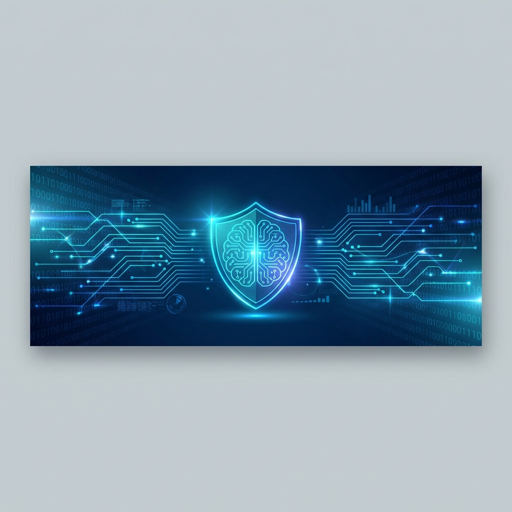

  

  <h1>Bahattin Yunus Çetin</h1>
  <h3>Veri Bilimcisi | Siber Güvenlik Mimarı | Yapay Zeka Mühendisi</h3>
  
  

    
  

  

    
    
    
    
    
  

 

## 👨‍💻 Hakkımda

Ben **Bahattin Yunus**, teknolojinin sınırlarında gezinmeyi seven bir **Veri Bilimcisi ve Siber Güvenlik Mimarıyım**. 2.5 yılı aşkın süredir, yapay zekayı savunma sistemleriyle birleştirerek daha güvenli bir dijital gelecek inşa etmek için çalışıyorum. Karmaşık veri setlerinden anlam çıkarmak ve siber tehditleri otonom sistemlerle avlamak benim tutkum.

> *"Bir sorunu çözmek için, o sorunu yaratan zihin yapısından çıkmalısınız."*

- 🔭 **Odak Alanım:** Otonom Siber Savunma Sistemleri & Derin Pekiştirmeli Öğrenme.
- 🌱 **Araştırma:** Kuantum Kriptografi ve Post-Quantum Güvenlik Algoritmaları.
- 💬 **İletişim:** Teknoloji, yapay zeka ve güvenlik üzerine her zaman konuşabiliriz.

---

  <h3>🏆 Başarılar & Kupalar</h3>
  

---

## 🛠️ Teknik Yetkinlikler (Tech Stack)

| **Yapay Zeka & Veri** | **Siber Güvenlik & Araçlar** | **Geliştirme & Altyapı** |
|:---:|:---:|:---:|
|  |  |  |
| **TensorFlow**, **PyTorch**, **OpenCV** | **Kali Linux**, **Wireshark**, **Metasploit** | **Python**, **C++**, **Go**, **Docker** |

 

### 🚀 Geliştirdiğim Projeler

| Proje İsmi | Açıklama | Teknoloji | Tür |
| :--- | :--- | :--- | :--- |
| **🛡️ AI Defense Shield** | Ağ trafiğini analiz edip siber saldırıları anlık tespit eden otonom IDS sistemi. | `Python` `Snort` `TensorFlow` | **Güvenlik** |
| **🧠 Neural Architect** | Veri setinin yapısına göre en uygun derin öğrenme modelini otomatik tasarlayan araç. | `PyTorch` `Scikit-Learn` | **Yapay Zeka** |
| **🔐 Quantum Key Gen** | Geleceğin şifreleme standartlarına uygun, kuantum dirençli anahtar üreticisi. | `C++` `Qiskit` | **Kriptografi** |

---

## 📜 İlham Kaynaklarım

Yazılım sadece kodlardan ibaret değildir; bir felsefesi ve ruhu vardır.

> **"Sakarya Saf Çocuğu"**
>
> *"İnsan üç beş damla kan, ırmak üç beş damla su;*
> *Bir hayata çattık ki, hayata kurmuş pusu."*
>
> — **Necip Fazıl Kısakürek**

 

> *"Düşünüyorum, öyleyse varım."* — **Descartes**
>
> *"Lafı bırak, kodu göster."* — **Linus Torvalds**

---

## 📊 İstatistikler ve Analizler

  
  

 

### 🐍 Katkı Geçmişim

  

  

---

## 🎓 Sertifikalar ve Yetkinlikler

<b>📜 Detaylı Sertifika Listesini Görüntüle (50+)</b>

 

| Tarih | Sertifika Adı | Sağlayıcı |
| :--- | :--- | :--- |
| **Ocak 2026** | **Intro to AI & LLM Architectures** | BTK Akademi |
| **Aralık 2025** | **Advanced Cyber Security Ops** | BTK Akademi |
| **Aralık 2025** | **Data Science Specialization** | Google |
| **Kasım 2025** | **Cloud & Big Data Analytics** | Microsoft |
| **Ekim 2025** | **Ethical Hacking & Pentesting** | Udemy |
| ... | *(ve diğerleri devam ediyor)* | ... |

 

  
   
  

