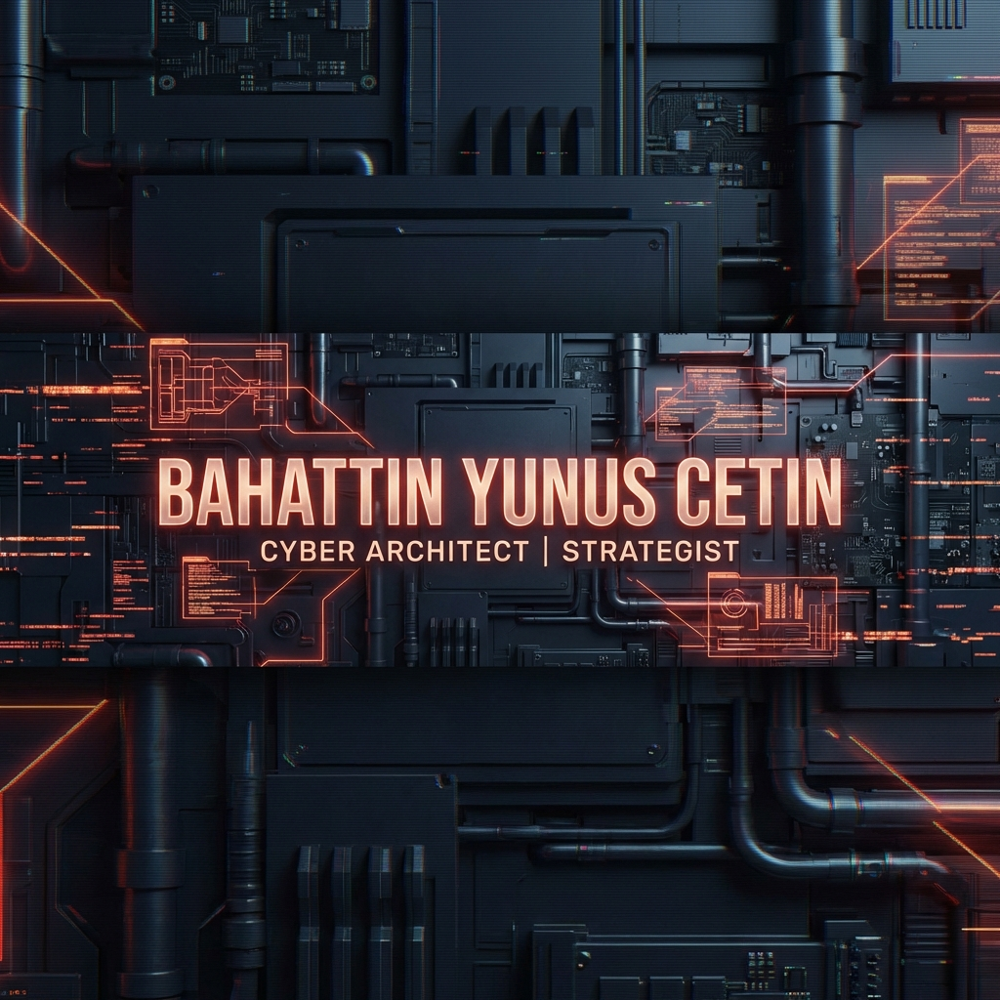

<!----

  

  
  

  

---->
  <h1 align="center">
  
  </h1>

  

<h3 align="center">  Data Science | AI | Cybersecurity | Defense Systems</h3>

  
  
  

 

 

  
 

<!---

  

--->

  

<h1 align="center">
  
</h1>

  

<h3 align="center">
  🌐 
  DEPLOYED OPERATIONAL INTERFACES
</h3>

  
  

  <i>Virtual architectures for the sovereign architect, designed to transcend the obsolescence of biological thinking, forging a new dimension where silicon logic reigns supreme and the system evolves faster than the world around it.</i>

  

<!---
 </img>
 

  

---->

<!---
### 🎖️ Operative Briefing
 🎓 **Rank**: Cyber Lieutenant (Senior Grade) | **Service**: 3+ Years in Software Operations  
 🔍 **Tactical Capabilities**: Advanced AI-ML Defense, Cyber Warfare Systems, Embedded Intelligence  
 🎯 **Primary Mission**: Developing robust neural networks and sovereign cybersecurity defense solutions  
 ⚡ **Deployment**: Active in Large-Scale Data Analytics & Intelligence Operations

--->

  

<h3 align="center">
  🔗 
  CONNECT WITH COMMAND
</h3>

  
  
  
  
  

  

<h3 align="center">
  🏆 
  OPERATIONAL TROPHIES
</h3>

  

  

<h3 align="center">
  🛠️ 
  TECHNICAL ARSENAL
</h3>

  

Certifications earned through specialized training programs

#### 🐍 Programming Languages

  
  
  
  
  
  

#### 🌐 Web Development

  
  
  

#### 🤖 Artificial Intelligence & Machine Learning

  
  

#### 🧠 Generative AI & LLMs

  
  
  
  
  

#### 🔒 Cybersecurity & Cryptography

  
  

#### 🔧 Development Tools & Version Control

  
  
  

#### ⚡ Hardware & IoT

  
  
  
  

<b>📋 Detailed Certification Records (Operational Database)</b>

  

<h3 align="center">Data Science | AI | Cybersecurity | Systems Architecture</h3>

  
  
  

  

  

<h3 align="center">
  🌐 
  DIGITAL ECOSYSTEMS & INTERFACES
</h3>

  
  

  <i>Geleceğin dijital mimarilerini inşa etmek, yapay zeka ve veriyi birleştirerek sürdürülebilir sistemler tasarlamak üzerine odaklanıyorum. Teknolojinin hızına ayak uyduran, akılcı ve ölçeklenebilir çözümler geliştiriyorum.</i>

  

<h3 align="center">
  🔗 
  CONNECT WITH ME
</h3>

  
  
  

<h3 align="center">
  🛠️ 
  TECHNICAL STACK & SPECIALIZATIONS
</h3>

#### 💻 Programming & Frameworks

  
  
  
  

#### 🧠 AI & Data Science

  
  
  

#### 🔒 Cybersecurity & Infrastructure

  
  
  

<b>📋 Professional Certification Records</b>

| 📅 Date | 🎖️ Certification | 🏢 Provider |
|:---:|:---:|:---:|
| **Jan 2026** | **AI & LLM Specialization** | BTK Akademi |
| **Dec 2025** | **Multimedia Security** | BTK Akademi |
| **Dec 2025** | **Network Defense & DDoS** | BTK Akademi |
| **Jul 2025** | **Advanced Python** | BTK Akademi |
| **Jun 2025** | **Systems Programming** | BTK Akademi |
| **May 2025** | **Cybersecurity Fundamentals** | BTK Akademi |

---

### 📈 GitHub Ecosystem

  

  

---

<h3 align="center">
  📜 
  DAILY PRINCIPLES
</h3>

<i>"Düşünüyorum, öyleyse varım." - Descartes</i> 
<i>"Zihnini şu ana odakla." - Buddha</i>

  

  
  
  

  

---->

### 📈 GitHub Activity Graph

  

---

### 🐍 Contribution Snake

  

---

### 💡 Random Dev Quote

  

---

### 📈 Currently Learning

  
  
  

---

### 📝 GitHub Metrics

  

### 📊 Detailed GitHub Stats

  
  

<!---

  
  

--->

### ⚡ Mission Status

  

### 🎨 Tech Stack Icons

  

---

  

<h3 align="center">
  🛡️ 
  TACTICAL SKILLS & SPECIALIZATIONS
</h3>

  
  
  
  
  

  

<h3 align="center">
  📜 
  DAILY OPERATIONAL DIRECTIVES
</h3>

<!-- START_QUOTE -->
### ⚡ Daily Operational Directives
- > **"Düşünüyorum, öyleyse varım. - Descartes"**
- > **"Geçmişte yaşama, geleceği hayal etme, zihnini şu ana odakla. - Buddha"**
- > **"Küsmek ve darılmak için bahaneler arayacağına, sevmek ve sevilmek için çareler ara. - Mevlana"**

<!-- END_QUOTE -->

---

  <a href="https://www.youtube.com/watch?v=9xADNPEu4