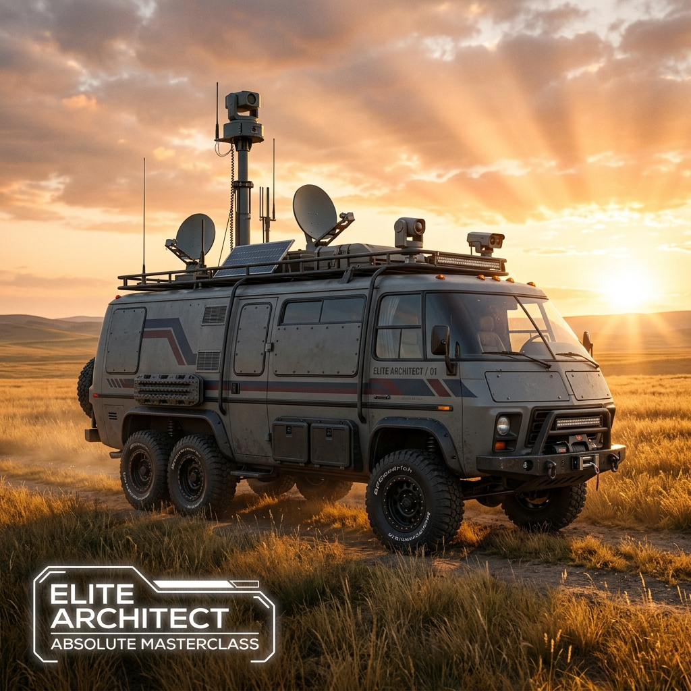

  
   

  

    
  

  

    
    
    
    
  

---
# Professional Profile

> **Founder @ Budak** & **Lead Researcher @ MERL**
> **Edge-AI Optimization Specialist | Industrial Engineering Student**

I am an **Edge-AI Optimization Specialist** and **Industrial Engineering** student operating at the strategic nexus of **Autonomous Robotics**, **System Efficiency**, and **On-Premise Artificial Intelligence**. My engineering doctrine is rooted in **"Security by Design"** — the art of distilling extreme complexity into resilient, scalable, and mission-critical architectures.

I architect end-to-end solutions for high-stakes environments, spanning from **Lunar Surface Navigation Stacks (ROS2/EKF)** to **Industrial AI Lifecycle Optimization (Quantization/Pruning)**. By merging the algorithmic rigor of AI with the systems-thinking approach of Industrial Engineering, I build autonomous ecosystems where absolute reliability and operational efficiency are the baseline, not the goal. 

I am committed to engineering the future of scalable, hardware-aware intelligent systems through the lens of **System Architecture** and **Mathematical Optimization**.

  

  

## 🛠️ Domain Mastery & Technical Ecosystem

| 🏗️ Architecture & Systems | 🧠 Intelligence & Data | 🛡️ Infrastructure & Security |
|:---:|:---:|:---:|
| Core Systems Design, Robotics, Distributed Architectures | Deep Learning, Computer Vision, Signal Processing | Cloud-Native, DevSecOps, RTOS Integrity |
|    |    |    |

  

## 🚀 High-Impact Architectures (2026 Core Initiatives)

| Initiatives (2026) | System Focus | Technological Core | Operational Health |
| :--- | :--- | :--- | :--- |
| **[AstroBio-Edge](https://github.com/arch-yunus/AstroBio-Edge-Architecture)** | Deep Space Biosignal | `Swarm AI` `Edge Computing` | 🟢 **Active** |
| **[Ay-Otonom](https://github.com/arch-yunus/Ay-Otonom-Navigasyon)** | Lunar Surface Navigation | `ROS2` `EKF` `Slam Toolbox` | 🟢 **Nominal** |
| **[MilliHaklar](https://github.com/arch-yunus/MilliHaklar-UzayHukuku)** | Space Law Legal-Tech | `SSA Data` `Legal-AI` | 🟢 **Deployed** |
| **[Cosmic-Sanitizer](https://github.com/arch-yunus/Cosmic-Telemetry-Sanitizer)** | Telemetry Integrity Stack | `Kalman Filter` `SEU Repair` | 🟢 **Production** |
| **[Aura-Hockey-AR](https://github.com/arch-yunus/Aura-Hockey-AR)** | Hand-Tracking 3D Game | `MediaPipe` `Three.js` | 🟢 **Verified** |
| **[TurkSpace-Platform](https://github.com/arch-yunus/TurkSpace-Platform)** | SpaaS Ecosystem | `Space Data` `Dashboard` | 🟢 **Nominal** |

  

## 📂 Strategic Systems Portfolio

<b>🤖 Robotics & Autonomous Intelligence</b>

| Project | Core Technology |
| :--- | :--- |
| [Ay-Otonom-Navigasyon](https://github.com/arch-yunus/Ay-Otonom-Navigasyon) | `ROS2` `EKF` `DWA` `A*` |
| [Formula Student Autonomous](https://github.com/arch-yunus/formula_student_autonomous_stack) | `ROS2` `YOLOv8` `MPC` |
| [ERC Rover GCS](https://github.com/arch-yunus/erc_rover_mission_control) | `Digital Twin` `Edge AI` |
| [Robotex Warrior Core](https://github.com/arch-yunus/robotex_warrior_core) | `C++20` `EKF` `DDS` |
| [LionSight AUV](https://github.com/arch-yunus/LionSight-AUV) | `Jetson Orin` `PyTorch` |
| [AQUASYNC](https://github.com/arch-yunus/AQUASYNC-Multi-Domain-Autonomous-Maritime-System) | `Swarm` `Nav2` `MAVLink` |
| [Robotaksi Full-Stack](https://github.com/arch-yunus/teknofest_robotaksi) | `Stanley` `Pure Pursuit` |

<b>🧠 Intelligence, Data Science & Neural Networks</b>

| Project | Core Technology |
| :--- | :--- |
| [AstroBio-Edge](https://github.com/arch-yunus/AstroBio-Edge-Architecture) | `Swarm AI` `Edge Computing` `Spectroscopy` |
| [Cosmic-Sanitizer](https://github.com/arch-yunus/Cosmic-Telemetry-Sanitizer) | `Kalman Smoothing` `Anomaly Detection` |
| [Akademik Radar](https://github.com/arch-yunus/AkademikRadar) | `SciBERT` `Graph Theory` |
| [Nexus TRL](https://github.com/arch-yunus/Nexus-TRL-LLM) | `LLM` `Data Analysis` |
| [NexusBroker](https://github.com/arch-yunus/NexusBroker) | `Vector DB` `Solidity` |
| [DeepAntenna](https://github.com/arch-yunus/ANN-for-Antenna-Design) | `TensorFlow` `ANN` |

<b>🛡️ Aerospace, Mission-Critical Systems & Cybersecurity</b>

| Project | Core Technology |
| :--- | :--- |
| [Feza-X (CubeSat)](https://github.com/arch-yunus/TerraSense-CubeSat-Architecture) | `NASA-cFS` `Aethel-Class` `CubeSat` |
| [RedPlanet-Habitat](https://github.com/arch-yunus/RedPlanet-Autonomous-Habitat) | `Habitat OS` `Planetary Scale` |
| [Otonom-İstasyon](https://github.com/arch-yunus/Otonom-Moduler-Istasyon) | `Orbital Defense` `CW-Dynamics` |
| [Kiyamet-Hatti](https://github.com/arch-yunus/Kiyamet-Hatti) | `SDR` `DMR/FT8` `SatCom` |
| [SIGINT HUB](https://github.com/arch-yunus/SIGINT) | `DSP` `FFT` `ELINT` |
| [NOAA Station](https://github.com/arch-yunus/NOAA) | `Orbital` `Signal Proc.` |
| [Digital Archaeology](https://github.com/arch-yunus/Digital-Archaeology-Steganography-Vault) | `Forensics` `Steganography` |
| [Milli Teknoloji Envanteri](https://github.com/arch-yunus/Milli-Teknoloji-Envanteri) | `Strategy` `TRL` |

<b>🏗️ Industrial IIoT & Digital Twin Architectures</b>

| Project | Core Technology |
| :--- | :--- |
| [ANATOLIA-SILICON](https://github.com/arch-yunus/ANATOLIA-SILICON) | `RISC-V` `Deep Tech` |
| [Industrial Intelligence](https://github.com/arch-yunus/teknofest_sanayide_dijital_teknolojiler) | `IIoT` `Digital Twin` |
| [CivTech-Core](https://github.com/arch-yunus/CivTech-Core) | `FEM` `Generative Design` |
| [CodeVisualizer](https://github.com/arch-yunus/CodeVisualizer) | `AST` `React` `FastAPI` |
| [NovaChat](https://github.com/arch-yunus/NovaChat-Real-Time-Messaging-App) | `Socket.IO` `Redis` |

---

  

## 📊 Analytical Intelligence & System Metrics

  
  

 

  
  

 

  

 

  

 

  
  

  

---

## 🎓 Domain Certifications & Advanced Training

  
  
  

<b>📜 Comprehensive Credential Archive (140+)</b>

 

| Apr 2026 | TUA ASTRO HACKATHON | Türkiye Uzay Ajansı | — |
| Apr 2026 | 5-Day White Hat Hacker Bootcamp | Siber Vatan / DOKA | — |
| Mar 2026 | INTERSTELLAR PROBLEM SOLVER | Türkiye Uzay Ajansı | — |
| Mar 2026 | Yapay Zekâ ile Görsel Sentez | BTK Akademi | D2xhE1Alml |
| Mar 2026 | TS EN 50600 Veri Merkezi Tesisleri ve Altyapıları Standardı | BTK Akademi | mKEhkNWJ6X |
| Mar 2026 | Sitescope ile Sistem İzleme | BTK Akademi | qKrheYWd01 |
| Mar 2026 | Grafik Tasarıma Giriş | BTK Akademi | OKMhqvKqDj |
| Mar 2026 | Bilgi Güvenliği Yönetim Sistemi | BTK Akademi | 4qgueLmnLY |
| Mar 2026 | API ve API Testi | BTK Akademi | 4qguegXX7r |
| Mar 2026 | SIEM Temelleri | BTK Akademi | gK2hakvzwK |
| Mar 2026 | Güvenlik Duvarına Giriş | BTK Akademi | OKMhw8EwMb |
| Mar 2026 | Telekomünikasyon Sistemleri Güvenliği | BTK Akademi | XV1hBdNm8l |
| Mar 2026 | Doküman Tipleri ve Veri Formatları | BTK Akademi | qKrheZWjeK |
| Mar 2026 | Web Sitesi Kullanılabilirliği | BTK Akademi | ZA1UM14oWD |
| Mar 2026 | İnternet Alan Adları Hukuku | BTK Akademi | qKrheYWWE4 |
| Mar 2026 | Google Dijital Pazarlama Temelleri | Google | ax1hrE94bx |
| Mar 2026 | 3-Karayolu Proje Çalışmaları | BTK Akademi | oJpSg49EYp |
| Mar 2026 | 6-Karayolu Yapım Çalışmaları | BTK Akademi | zXztnmNe2o |
| Mar 2026 | 8-Karayollarında Trafik Güvenliği Çalışmaları | BTK Akademi | L8dcNpnYyA |
| Mar 2026 | Beyaz Şapkalı Hacker Eğitimi | Siber Vatan | — |
| Mar 2026 | 10-Özel ve Tarihi Köprüler | BTK Akademi | nKqhnWbmG7 |
| Mar 2026 | Yapay Zekâ Hukuku | BTK Akademi | qKrheZ0lrM |
| Mar 2026 | KVKK, GDPR Eğitim Seti | BTK Akademi | WJ1SMLnmrd |
| Şub 2026 | Uzaktan Erişim Araçları | BTK Akademi | 8jmhNZEEZZ |
| Şub 2026 | Program ve Portföy Yönetimi | BTK Akademi | BozfGVqboj |
| Şub 2026 | Sosyal Medya Uzmanlığına Giriş | BTK Akademi | 7rptZxEryp |
| Şub 2026 | Fikri ve Sınai Mülkiyet Hakları | BTK Akademi | PVghbqvyVe |
| Şub 2026 | Makine Öğrenmesinin Matematiksel Temelleri | BTK Akademi | gK2halKOrV |
| Şub 2026 | E-Ticarete Giriş | BTK Akademi | 7rptZxE7ya |
| Şub 2026 | 4-Kamulaştırma Süreci | BTK Akademi | wmlFmB1rX4 |
| Şub 2026 | 9-Devlet ve İl Yollarında Bakım ve İşletme Sürecine Giriş | BTK Akademi | 6mqF01q9Yy |
| Şub 2026 | 7-Yol Yapım, Bakım, Onarım Makine ve Ekipmanları | BTK Akademi | ZA1Ura7jgd |
| Şub 2026 | 2-Karayolu Projeleri Fizibilite Etütleri | BTK Akademi | Ko9fE0xM1J |
| Şub 2026 | 1-KGM Tarihçesi, Görev, Yetki ve Sorumlulukları | BTK Akademi | lK1hwkggAa |
| Şub 2026 | 5-Malzeme Ocakları Yönetim Süreci | BTK Akademi | GoDfm64AA9 |
| Şub 2026 | Proje Yönetimi | BTK Akademi | lK1hw74pZw |
| Şub 2026 | Uluslararası İş Analizi Metodolojisi ve Teknikleri | BTK Akademi | L8dcNeAVPK |
| Şub 2026 | Veri Okuryazarlığı Eğitimi | 23 | Yirmi Üç | 1774b535-4b29-4c25-b11b-291d57f9b481 |
| Şub 2026 | Sosyal Medyada Yapay Zeka ile Dijital Pazarlama | BTK Akademi | AKkkf7kNJla |
| Şub 2026 | Sosyal Medya ve İnternet Muhabirliği | BTK Akademi | XlOOsBKZW6Z |
| Şub 2026 | Sosyal Medya İçerik Üretimi | BTK Akademi | kJMMHbnypXg |
| Şub 2026 | Sosyal Medyada Tasarım Temelli İçerik Üretimi | BTK Akademi | m688uk1ErWp |
| Şub 2026 | Sosyal Medyada Marka İletişimi ve İşbirlikleri | BTK Akademi | VljjsgWkaKA |
| Şub 2026 | Sosyal Medya Etkileyicilerinin Hukuki Sorumluluğu | BTK Akademi | xoBBUN4brZL |
| Şub 2026 | Sosyal Medyada İçerik Üretim Süreci & Hikâye Anlatıcılığı | BTK Akademi | xoBBUN4bLgn |
| Şub 2026 | Sosyal Medya Reklamcılığı ve Performans Analitiği | BTK Akademi | AKkkf7kwlrL |
| Şub 2026 | Ankara AI Hackathon | Teknopark Ankara | jeqDhGDaZKq |
| Oca 2026 | Articulate Storyline 360 İleri Seviye | BTK Akademi | nwJltz89 |
| Oca 2026 | Google Dijital Ebeveynlik | Google | 4qgueLmn07 |
| Oca 2026 | Markaların Korunması | BTK Akademi | WJ1SMLlqMZ |
| Oca 2026 | Finansal Okuryazarlık Eğitimi | 23 | Yirmi Üç | 3c44f88d-1944-4919-b750-67f769f6e5ad |
| Oca 2026 | HeyGen | BTK Akademi | WJ1SkN2p9n |
| Oca 2026 | ElevenLabs | BTK Akademi | 8jmhNjXbP2 |
| Oca 2026 | Gemini Veo | BTK Akademi | oJpSgnayWO |
| Oca 2026 | Hailuo AI | BTK Akademi | 4qguek4NB9 |
| Oca 2026 | Finansal Piyasalara Giriş | BTK Akademi | Ko9fEG7WZG |
| Oca 2026 | Üretken Yapay Zekâ ile Tercüme | BTK Akademi | OKMhwopAnN |
| Oca 2026 | Veri Bilimi için Temel İstatistik | BTK Akademi | lK1h7n9And |
| Oca 2026 | Matematik 101 | BTK Akademi | yjahJpZVEB |
| Oca 2026 | İnsan Haklarına Giriş | BTK Akademi | JoNf2pbD6z |
| Oca 2026 | Uluslararası İlişkilerde Yapay Zekâ | BTK Akademi | pKmhqp2DYG |
| Oca 2026 | Anthropic Claude | BTK Akademi | bx1hLxXZOo |
| Oca 2026 | ChatGPT | BTK Akademi | OKMhwBXgqW |
| Oca 2026 | Manus AI | BTK Akademi | ZA1UrdE2Bj |
| Oca 2026 | NotebookLM | BTK Akademi | 8jmhNZeyk6 |
| Oca 2026 | Yapay Zekâ Dünyasına Giriş | BTK Akademi | 7rptPBld1p |
| Oca 2026 | Perplexity | BTK Akademi | Ko9fE4NpKx |
| Oca 2026 | Canva Magic Design | BTK Akademi | ZA1UrdEkWO |
| Oca 2026 | Gamma | BTK Akademi | GoDfm1rwNr |
| Oca 2026 | DeepSeek | BTK Akademi | lK1hwey4xw |
| Ara 2025 | ROTAMIZ UFKUN ÖTESİ | KTU Gemi İnşaatı ve Deniz Teknolojileri Kulübü | — |
| Ara 2025 | 21. Yüzyılda Sahadan Akademiye Uluslararası Terörizm | Türk Dünyası Gençlik Vakfı | 2025_KTÜ6146006461910 |
| Ara 2025 | FMCG Zirvesi | KTÜ İşletme ve Ekonomi Kulübü | — |
| Ara 2025 | Certificate of Achievement – Use of Artificial Intelligence in Multimedia Data Security Workshop | BTK Akademi | WzBbI9py |
| Ara 2025 | Social Engineering and Phishing | BTK Akademi | WJ1SkZbe4d |
| Ara 2025 | DoS / DDoS Attacks and Protection | BTK Akademi | XV1hBdNpMv |
| Ara 2025 | Underwater Systems Training | T3 Vakfı | — |
| Kas 2025 | Aviation & Space Exploration Camp – Certificate (2025) | TÜBİTAK | — |
| Kas 2025 | Project Management Basics | BTK Akademi | wmlFmJkB29 |
| Eki 2025 | Artificial Intelligence Ethics | BTK Akademi | MAZUE7xX2D |
| Eki 2025 | Use of Generative Artificial Intelligence in Research | BTK Akademi | D2xhEEKoYN |
| Eki 2025 | Introduction to Generative Artificial Intelligence | BTK Akademi | eK1hOjmKgG |
| Eki 2025 | Introduction to Artificial Intelligence and Algorithms | BTK Akademi | 6mqFNkwJxA |
| Eyl 2025 | Datathon 2025 Data Competition | BTK Akademi | bzAaiLLYxmy |
| Ağu 2025 | Hüyük Youth Camp | Gençlik ve Spor Bakanlığı | — |
| Tem 2025 | Digital Literacy | BTK Akademi | OKMhqeyObw |
| Tem 2025 | Python 2 | BTK Akademi | dx1hAG0d1z |
| Haz 2025 | Javascript Basics | BTK Akademi | gK2hoVBwj9 |
| Haz 2025 | Project and Risk Management | BTK Akademi | 8jmhLX7yMG |
| Haz 2025 | C++ | BTK Akademi | 6mqFNqLYdA |
| Haz 2025 | Go | BTK Akademi | xr4t0Jeolm |
| May 2025 | ANDROİD ATÖLYESİ | GDG Trabzon | — |
| May 2025 | Fundamentals of Cryptography | BTK Akademi | kK1hVD09dy |
| May 2025 | Python 1 | BTK Akademi | Yx1hPL1mGY |
| May 2025 | Version Control: Git and GitHub | BTK Akademi | NowfnNpDAz |
| May 2025 | Introduction to Cybersecurity | BTK Akademi | XV1hWEow9j |
| May 2025 | 8. YAZILIM GÜNÜ | Karadeniz Teknik Üniversitesi Yazılım Kulübü | — |
| May 2025 | MicroBit Programming with MicroPython | BTK Akademi | 1kZCoxNdMM |
| May 2025 | Arduino Programming with Tinkercad | BTK Akademi | BozfGwDZbx |
| Nis 2025 | CSS Fundamentals | BTK Akademi | 7rptZAreZ1 |
| Nis 2025 | Web Development with HTML5 | BTK Akademi | rKjhGyp8LJ |
| Mar 2025 | Custom GPTs | BTK Akademi | ax1hDzvgrE |
| Şub 2025 | Geleceğini Netleştir | Karadeniz Teknik Üniversitesi Endüstri Mühendisliği Kulübü | — |
| Ara 2024 | Financial Literacy | BTK Akademi | AJaSdLzWW1 |
| Ara 2024 | Gençlik Vizyon Çalıştayı | Gençlik ve Spor Bakanlığı | — |
| Ara 2024 | Yapay Zeka Zirvesi 2024 | Türkiye Girişimcilik Vakfı | G9LlUnWlq4X |
| Ara 2024 | Devfest Trabzon | GDG Trabzon | — |
| Ara 2024 | DATA&AI SUMMIT | KTU Artificial Intelligence Society | — |
| Kas 2024 | Small Basic | BTK Akademi | 9Xrtq18yXl |
| Eki 2024 | Persuasion Skills | BTK Akademi | pKmhKr9Xxj |
| Eki 2024 | Effective Communication Strategies | BTK Akademi | vpWc8Mb1Ao |
| Eki 2024 | Public Speaking and Presentation Techniques | BTK Akademi | GoDfn0V2xB |
| Eki 2024 | Introduction to Artificial Intelligence | BTK Akademi | zXztak2EeO |
| Eki 2024 | Introduction to Information Technology | BTK Akademi | gK2hoD7Lqj |
| Eki 2024 | İşletim Sistemlerine Giriş | BTK Akademi | 7rptZxqGKp |
| Eki 2024 | Circuit Design with Proteus | BTK Akademi | ax1hDAjV9N |
| Eki 2024 | Introduction to Basic Electronics and Robotics | BTK Akademi | 1kZCozGVO7 |
| Eki 2024 | Fundamentals of Entrepreneurship | BTK Akademi | XV1hWEv6VY |
| Eki 2024 | Communication and Network Management | BTK Akademi | yjahJpaPNz |
| Eki 2024 | Presentation Techniques | BTK Akademi | zXztak2MEd |
| Eki 2024 | Problem Solving Techniques | BTK Akademi | zXztak7gdZ |
| Eki 2024 | Team Building and Management | BTK Akademi | 7rptZxqG9P |
| Eki 2024 | C Programming Language | BTK Akademi | GoDfn444BW |
| Mar 2023 | IHA - 1 - Sportif / Amatör | SHGM / Sivil Havacılık Genel Müdürlüğü | TR-IHA1H10609053 |
| — | Sözleşme Yönetimi Hukuku | BTK Akademi | EoPfJJEzwb |
| — | Design Protection | BTK Akademi | 7rptZgnMXy |
| — | Information Reporting Center and Social Media Complaint Procedures | BTK Akademi | yjahzAKKW1 |
| — | Applied Business Model Development | BTK Akademi | oJpS7m2kwM |
| — | Protection of Patents and Utility Models | BTK Akademi | jK1hKrZEYN |
| — | Digital Retail Expertise | BTK Akademi | nKqhneAAjL |
| — | Interview Techniques | BTK Akademi | lK1h7nZOBZ |
| — | Coping with Stress and Mindful Awareness | BTK Akademi | MAZUNeOraZ |
| — | Protection of Geographical Indications | BTK Akademi | wmlFJrZkJv |
| — | IT Law | BTK Akademi | 2NwcJJnl84 |
| — | Company Valuation and Investment Processes | BTK Akademi | OKMhqpzgrp |
| — | Market Research and Pricing Strategies | BTK Akademi | 6mqFN8zGOM |
| — | Creating an Effective LinkedIn Profile | BTK Akademi | Nowfrb1zOx |
| — | Career-Threatening Approaches for Young Professional | BTK Akademi | MAZUENAJ9z |
| — | Career Goal Setting | BTK Akademi | 0KohzoGvkW |
| — | Sales and Marketing Management | BTK Akademi | WJ1SMLlqOO |
| — | Knowing the Customer | BTK Akademi | 0KohzoGvee |
| — | Career-Threatening Approaches | BTK Akademi | 2Nwc0Bk4k |

---

<!-- START_QUOTE -->
## ⚖️ Architectural Logic & Visionary Principles

> *“Bir devletin yıkılışı, adalet mefhumunun sarsılmasıyla başlar. - Kınalızade Ali Efendi”*

- **System Strategy**: Devler gibi eserler bırakmak için, karıncalar gibi çalışmak lazım. - Necip Fazıl Kısakürek
- **Operational Integrity**: Hayal gücü, bilgiden daha önemlidir. - Albert Einstein
- **Architectural Vision**: Zayıf insanlar intikam alır, güçlü insanlar affeder, zeki insanlar umursamaz. - Albert Einstein
- **Logic & Reason**: Aslanı yenmek kolaydır, asıl kahraman nefsini yenendir. - Akşemsettin
<!-- END_QUOTE -->

---

 

  
    
  
   
  <i>"Architecture is about the important stuff. Whatever that is." — Ralph Johnson</i>
    
  <b>Bahattin Yunus ÇETİN</b> 
  <i>Founder @ Budak | AI Researcher & Edge-AI Developer</i> 
   
  
   
  <small>© 2026 — Built with Precision & Intent</small>

  

