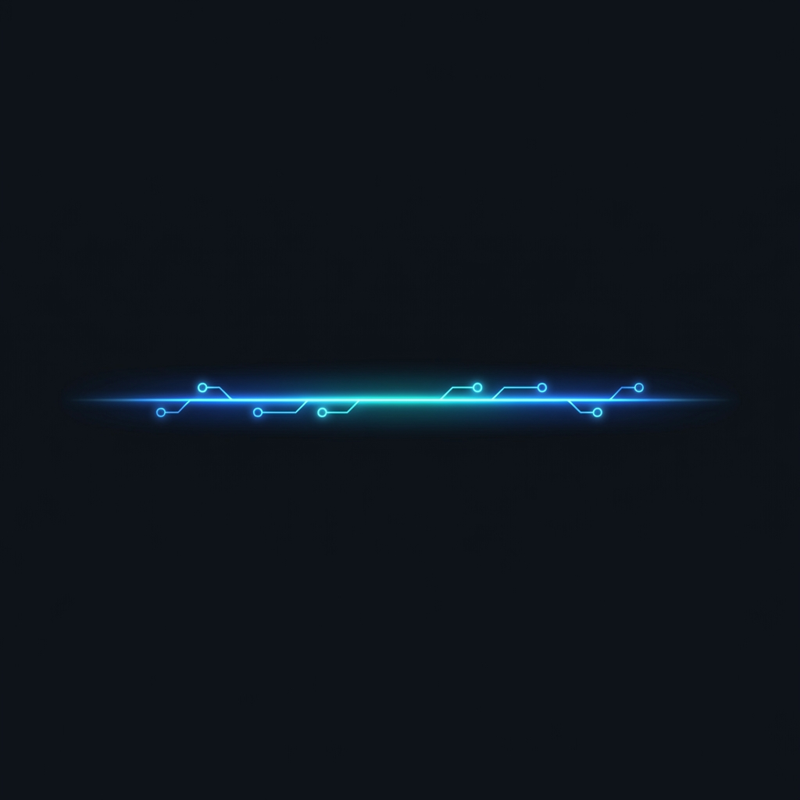

  

  <h1>Bahattin Yunus Çetin</h1>
  <h3>Otodidakt Araştırmacı | YZ Bilimcisi & BT Mimarı</h3>
  <h4><i>Otonom Sistemler & Siber Güvenlik Uzmanı</i></h4>
  
  

    
  

  

    
    
    
    
    
  

 

  <b><a href="#vision">🎯 Vizyon</a></b> &nbsp;•&nbsp;
  <b><a href="#tech">🛠️ Teknoloji</a></b> &nbsp;•&nbsp;
  <b><a href="#projects">📂 Projeler</a></b> &nbsp;•&nbsp;
  <b><a href="#stats">📊 Analiz</a></b> &nbsp;•&nbsp;
  <b><a href="#contact">🤝 İletişim</a></b>

 

## 🎯 Vizyon & Profesyonel Özet

Teknoloji, sadece kod yazmak değil; **geleceği inşa etmektir**.

Ben **Bahattin Yunus**; disiplinlerarası bir yaklaşımla **Yapay Zeka**, **Otonom Sistemler** ve **Siber Güvenlik** ekseninde çalışan; sadece teknolojiyi kullanan değil, temel prensiplerini yeniden tanımlayan bir **Otodidakt Araştırmacı** ve **Sistem Mimarıyım**. 

Dijital dünyanın kaotik yapısı içinde, deterministik ve öngörülebilir sistemler kurmak benim temel yetkinliğimdir. Çalışmalarım, klasik yazılım mühendisliğinin ötesine geçerek; **Savunma Sanayii**'nin kritik güvenlik gereksinimlerinden, **Finansal Teknolojilerin** yüksek işlem hacimli mimarilerine kadar geniş bir spektrumu kapsar.

Amacım net: **Karmaşık, çok boyutlu ve belirsizlik içeren endüstriyel problemleri; ölçeklenebilir, kendi kendini yönetebilen ve matematiksel olarak kanıtlanabilir 'Güvenli Zeka' sistemlerine dönüştürmek.**

Klasik mühendislik sınırlarının ötesinde, **teorik matematiği** pratik **saha uygulamalarıyla** birleştirerek; dijital egemenlik, kuantum sonrası güvenlik ve dağıtık zeka ağları üzerine stratejik mimariler geliştiriyorum.

> *"Bir sorunu çözmek için, o sorunu yaratan zihin yapısından çıkmalısınız."* - **Albert Einstein**

- 🔭 **Misyon:** Akıllı Bilişimin Sınırlarını Keşfetmek & Otonom Geleceği Tasarlamak.
- 🧬 **Metodoloji:** First Principles Thinking (İlk Prensipler) & Anti-Fragile Architecture.
- 🎯 **Odak:** Savunma Sanayii, Finansal Teknolojiler ve Büyük Dil Modelleri (LLM).

<a href="#top">⬆️ Başa Dön</a>

---

## 🧠 Mühendislik Doktrini

> **"Basitlik, karmaşıklığın nihai çözümüdür."**

Mühendislik yaklaşımım; sadece kod yazmak değil, **kaosun içinde deterministik ve sürdürülebilir düzen** inşa etmektir.

*   **⚡ Anti-Fragility (Anti-Kırılganlık):**  
    Klasik dayanıklılık (resilience) kavramı, darbeye dayanıp eski haline dönmeyi hedefler. Anti-kırılganlık ise **kaostan beslenir**. Tasarladığım sistemler, yüksek stres, siber saldırı veya beklenmedik yük durumlarında sadece ayakta kalmaz; bu anomalileri birer **"öğrenme verisi"** olarak işleyerek mimari bağışıklığını güçlendirir.
    
*   **🛡️ Zero Trust Architecture (Sıfır Güven):**  
    Güvenlik, bir güvenlik duvarı (firewall) veya antivirüs yazılımı değildir; sistemin en küçük yapı taşına kadar işlenmiş bir **genetik koddur**. Ağ içindeki her mikro-servis, her veri paketi ve her kullanıcı kimliği; "dışarıdan gelmiş bir tehdit" muamelesi görür ve her adımda kriptografik olarak doğrulanır. **"Asla güvenme, her zaman doğrula."**
    
*   **🦅 First Principles (İlk Prensipler):**  
    Mevcut çözümleri kopyalamak (analoji) yerine, problemleri fiziksel ve mantıksal atomlarına ayırarak **kökten çözümler** üretirim. Bir sistemin "nasıl" yapıldığını değil, "neden" o şekilde çalışması gerektiğini sorgular; optimum çözümü sıfırdan, temel doğrular üzerine inşa ederim.

---

## 🔬 Araştırma & Geliştirme Odakları (R&D Pillars)

**Meta-Mühendislik & Kognitif Çekirdek Tasarımı**
"Software 2.0" paradigmasının ötesine geçerek; yazılımın üretim sürecini insan bağımlı bir "zanaat" (craftsmanship) olmaktan çıkarıp, deterministik ve endüstriyel bir otonomi seviyesine taşıyorum. Kendi kendini analiz eden (Self-Introspection), çalışma zamanında hatalarını yamayan (Runtime Patching) ve sürekli optimize eden **"Polymorphic Codebases"** (Polimorfik Kod Tabanları) üzerine mimari araştırmalar yürütüyorum.

**Edge AI & Silikon Bağımsızlığı (Silicon Sovereignty)**
Merkezi bulut sağlayıcılarının (Cloud Oligarchy) veri üzerindeki hakimiyetini kırmak için; yapay zekayı veri merkezlerinden çıkarıp uç cihazlara (Edge) indirgiyorum. **`INT4` Quantization**, **Knowledge Distillation** ve **Pruning** tekniklerini birleştirerek; milyarlarca parametreli modelleri, internet bağlantısına ihtiyaç duymayan, enerji verimli ve gizlilik odaklı **"Gömülü Zeka"** (Embedded Intelligence) birimlerine dönüştürüyorum.

---

  <h3>🏆 Başarılar & Kupalar</h3>
  

  

## 🛠️ Teknik Yetkinlikler (Tech Stack)

| **Yapay Zeka & Veri** | **Siber Güvenlik & Araçlar** | **Geliştirme & Altyapı** |
|:---:|:---:|:---:|
|  |  |  |
| **TensorFlow**, **PyTorch**, **OpenCV** | **Kali Linux**, **Wireshark**, **Metasploit** | **Python**, **C++**, **Go**, **Docker** |

<a href="#top">⬆️ Başa Dön</a>

 

### 🌌 Vizyon Projeleri (Flagships)

> **🚀 [Mars Rover Control OS](https://github.com/bahattinyunus/Mars-Rover-Control-OS)**
>
> **`ROS2` `C++17` `Deep Space`**
> *Yüksek radyasyon, termal dalgalanmalar ve ekstrem iletişim gecikmeleri (High-Latency) altında çalışabilen; görev kritik (Mission-Critical) sistemler için özel olarak optimize edilmiş, gerçek zamanlı (RTOS) ve hataya dayanıklı (Fault-Tolerant) bir otonom keşif mimarisi.*

> **🧠 [ANKA-LLM: Milli AI İşletim Sistemi](https://github.com/bahattinyunus/ANKA-LLM)**
>
> **`LLM Architecture` `NPU Design` `Digital Sovereignty`**
> *Ulusal veri güvenliği standartlarına (GDPR/KVKK) tam uyumlu, hassas verilerin ülke sınırları dışına çıkmasını engelleyen; donanım agnostik yapısıyla hem yerel sunucularda hem de bulut kümelerinde yüksek performansla çalışabilen ölçeklenebilir Büyük Dil Modeli (LLM) altyapısı.*

> **⚓ [Mavi Vatan 2053: Alpha-X Komuta Merkezi](https://github.com/bahattinyunus/denizalti-akademisi)**
>
> **`Defense Tech` `Acoustic Stealth` `Strategy`**
> *Modern denizaltı harbi (ASW) doktrinleri için geliştirilmiş; sualtı akustik sinyal işleme, hedef tespiti ve otonom karar destek mekanizmalarını tek bir merkezde birleştiren, ağ merkezli (Network-Centric) ve modüler bir dijital komuta kontrol çerçevesi.*

 

### 📂 Proje Envanteri & Uzmanlık Alanları

#### 🤖 Otonom Sistemler & Robotik
| Proje | Açıklama | Teknoloji |
| :--- | :--- | :--- |
| **[Formula Student Autonomous](https://github.com/bahattinyunus/formula_student_autonomous_stack)** | Yarış araçları için yüksek hızlı otonom sürüş yığını. MPC & LiDAR SLAM. | `ROS2` `YOLOv8` `MPC` |
| **[ERC Rover GCS](https://github.com/bahattinyunus/erc_rover_mission_control)** | İnsan-Makine işbirliği odaklı Omega Edition Yer Kontrol İstasyonu. | `Digital Twin` `Edge AI` |
| **[Robotex Warrior Core](https://github.com/bahattinyunus/robotex_warrior_core)** | Rekabetçi robotik için milisaniye hassasiyetli SPDA kontrol çekirdeği. | `C++20` `EKF` `DDS` |
| **[LionSight AUV](https://github.com/bahattinyunus/LionSight-AUV)** | İstilacı türlerle mücadele eden, derin öğrenme destekli sualtı robotu. | `Jetson Orin` `PyTorch` |
| **[Project-AQUASYNC](https://github.com/bahattinyunus/AQUASYNC-Multi-Domain-Autonomous-Maritime-System)** | USV ve AUV birimlerini senkronize eden çok alanlı (Multi-Domain) sürü sistemi. | `Swarm` `Nav2` `MAVLink` |
| **[Robotaksi Full-Stack](https://github.com/bahattinyunus/teknofest_robotaksi)** | Şehir içi tam otonom sürüş mimarisi. | `Stanley` `Pure Pursuit` |

#### 🧠 Yapay Zeka & Veri Stratejisi
| Proje | Açıklama | Teknoloji |
| :--- | :--- | :--- |
| **[Akademik Radar](https://github.com/bahattinyunus/AkademikRadar)** | Küresel bilimsel trendleri analiz eden nöral semantik istihbarat motoru. | `SciBERT` `Graph Theory` |
| **[Nexus TRL](https://github.com/bahattinyunus/Nexus-TRL-LLM)** | LLM modellerini TRL metodolojisiyle analiz eden stratejik istihbarat platformu. | `Data Analysis` `TRL` |
| **[NexusBroker](https://github.com/bahattinyunus/NexusBroker)** | AI destekli, güven gerektirmeyen (trustless) hibrit ticaret ekosistemi. | `Vector DB` `Solidity` |
| **[DeepAntenna](https://github.com/bahattinyunus/ANN-for-Antenna-Design)** | Mikroşerit anten tasarımı için Yapay Sinir Ağı (ANN) tabanlı analiz platformu. | `TensorFlow` `Maxwell` |

#### 🛡️ Savunma, Uzay & Siber Güvenlik
| Proje | Açıklama | Teknoloji |
| :--- | :--- | :--- |
| **[Kiyamet-Hatti](https://github.com/bahattinyunus/Kiyamet-Hatti)** | Afet durumları için dijital HAM istasyonu ve acil durum haberleşme protokolü. | `SDR` `DMR/FT8` `SatCom` |
| **[SIGINT HUB](https://github.com/bahattinyunus/SIGINT)** | Modern elektronik harp için sinyal istihbaratı ve spektrum analizi merkezi. | `DSP` `FFT` `ELINT` |
| **[Radiosonde Hunting](https://github.com/bahattinyunus/Radiosonde-Hunting)** | Meteorolojik balon takibi ve gerçek zamanlı telemetri analiz portalı. | `SDR` `SondeHub` `Python` |
| **[NOAA Station](https://github.com/bahattinyunus/NOAA)** | Uydu sinyal yakalama (APT) ve meteorolojik görüntü işleme birimi. | `Orbital` `Signal Proc.` |
| **[Milli Teknoloji Envanteri](https://github.com/bahattinyunus/Milli-Teknoloji-Envanteri)** | Savunma ve yüksek teknoloji ekosistemi için stratejik TRL haritalama. | `Strategy` `Inventory` |
| **[Digital Archaeology](https://github.com/bahattinyunus/Digital-Archaeology-Steganography-Vault)** | Veri kurtarma ve ileri steganografi (gizli iletişim) mahzeni. | `Forensics` `Steganography` |

#### 🏗️ Endüstriyel Mimari & Sistemler
| Proje | Açıklama | Teknoloji |
| :--- | :--- | :--- |
| **[ANATOLIA-SILICON](https://github.com/bahattinyunus/ANATOLIA-SILICON)** | Küresel silikon hegemonyasına karşı RISC-V tabanlı donanım manifestosu. | `RISC-V` `Deep Tech` |
| **[Industrial Intelligence](https://github.com/bahattinyunus/teknofest_sanayide_dijital_teknolojiler)** | Endüstri 4.0 Dijital İkiz ve Kestirimci Bakım platformu. | `IIoT` `Predictive Maint.` |
| **[Agri-Arch-TR](https://github.com/bahattinyunus/teknofest_tarim_teknolojileri)** | Hassas tarım sistemleri için IoT ve Otonom Araç mimarisi. | `LoRaWAN` `Fuzzy Logic` |
| **[CivTech-Core](https://github.com/bahattinyunus/CivTech-Core)** | İnşaat mühendisliğini AI ve IoT ile birleştiren açık kaynak framework. | `FEM` `Generative Design` |
| **[PoseidonEye](https://github.com/bahattinyunus/PoseidonEye)** | Gemi makineleri için IoT tabanlı kestirimci bakım ve anomali tespiti. | `IoT` `Isolation Forest` |
| **[Open Textile Intelligence](https://github.com/bahattinyunus/Open-Textile-Intelligence)** | Tekstilde otonom kalite kontrol ve bilgisayarlı görü platformu. | `Computer Vision` `Qt` |
| **[Energy Grid Pulse](https://github.com/bahattinyunus/Energy-Grid-Pulse)** | Enerji teknolojileri için TRL analizi ve şebeke simülasyonu. | `Microgrid` `Simulation` |
| **[E-VİZÖR](https://github.com/bahattinyunus/E-VIZOR)** | Otonom vergi ve evrak yönetim sistemi (FinTech). | `OCR` `Blockchain` |
| **[Fin-Arch-TR](https://github.com/bahattinyunus/teknofest_finansal_teknolojiler)** | Kurumsal finansal sistemler ve çekirdek defter (Ledger) mimarisi. | `Event Sourcing` `ACID` |

#### 💻 Yazılım Araçları & Frameworkler
| Proje | Açıklama | Teknoloji |
| :--- | :--- | :--- |
| **[Computer Efficiency](https://github.com/bahattinyunus/Computer-Efficiency-Mastery)** | "Supreme Master" verimlilik manifestosu. NixOS, Neovim ve optimizasyon. | `NixOS` `Neovim` `Linux` |
| **[CodeVisualizer](https://github.com/bahattinyunus/CodeVisualizer)** | AST tabanlı kod mimarisi görselleştirme motoru. | `AST` `React` `FastAPI` |
| **[PhysicEngine](https://github.com/bahattinyunus/PhysicEngine)** | Python tabanlı yüksek performanslı 2D fizik simülasyon motoru. | `Physics` `Vector Math` |
| **[NovaChat](https://github.com/bahattinyunus/NovaChat-Real-Time-Messaging-App)** | Gerçek zamanlı mesajlaşma ve sistem mimarisi iskeleti. | `Socket.IO` `Redis` |
| **[BeeRoute](https://github.com/bahattinyunus/BeeRoute)** | Endüstriyel rotalama için stokastik sürü zekası (ABC) çerçevesi. | `Swarm Intel` `Optimization` |

<a href="#top">⬆️ Başa Dön</a>

---

## 📊 Analitik Veriler & Katkı

 

<table>
  <tr>
    <td width="50%" valign="top">
      
    </td>
    <td width="50%" valign="top">
      
    </td>
  </tr>
</table>

### 🐍 Aktivite & Katkı Döngüsü

 
  

<a href="#top">⬆️ Başa Dön</a>

---

## 🎓 Sertifikalar & Yetkinlikler

  
  
   

<b>📜 Detaylı Sertifika Listesini Görüntüle (90+)</b>

 

| Tarih | Sertifika Adı | Sağlayıcı | Detay / Proje / ID |
| :--- | :--- | :--- | :--- |
| **Ocak 2026** | **Intro to AI & LLM Architectures** | BTK Akademi | 🆔 `bx1hLxXZOo` |
| **Ocak 2026** | **Generative AI with Large Language Models** | DeepLearning.AI | 🆔 `bx1hLxXZOo` (Anthropic Claude) |
| **Ocak 2026** | **Articulate Storyline 360 İleri Seviye** | BTK Akademi | [📂 Lab Projesi](https://github.com/bahattinyunus/BTK-Articulate-Storyline-360-Lab) |
| **Ocak 2026** | **Canva Magic Design** | BTK Akademi | 🆔 `ZA1UrdEkWO` |
| **Ocak 2026** | **ChatGPT** | BTK Akademi | 🆔 `OKMhwBXgqW` |
| **Ocak 2026** | **DeepSeek LLM Ops** | BTK Akademi | 🆔 `lK1hwey4xw` |
| **Ocak 2026** | **ElevenLabs Voice AI** | BTK Akademi | 🆔 `8jmhNjXbP2` |
| **Ocak 2026** | **Finansal Okuryazarlık Eğitimi** | 23 | Yirmi Üç | 🆔 `3c44f88d...` |
| **Ocak 2026** | **Finansal Piyasalara Giriş** | BTK Akademi | 🆔 `Ko9fEG7WZG` |
| **Ocak 2026** | **Gamma AI Presentation** | BTK Akademi | 🆔 `GoDfm1rwNr` |
| **Ocak 2026** | **Gemini Veo Multimodal** | BTK Akademi | 🆔 `oJpSgnayWO` |
| **Ocak 2026** | **Google Dijital Ebeveynlik** | Google | 🆔 `4qgueLmn07` |
| **Ocak 2026** | **Hailuo AI Video Generation** | BTK Akademi | 🆔 `4qguek4NB9` |
| **Ocak 2026** | **HeyGen Avatar Synthesis** | BTK Akademi | 🆔 `WJ1SkN2p9n` |
| **Ocak 2026** | **Manus AI Automation** | BTK Akademi | 🆔 `ZA1UrdE2Bj` |
| **Ocak 2026** | **Markaların Korunması** | BTK Akademi | 🆔 `WJ1SMLlqMZ` |
| **Ocak 2026** | **Matematik 101: Developer's Principia** | BTK Akademi | [📂 Math2Code](https://github.com/bahattinyunus/Math2Code-A-Practical-Guide-for-Developers) |
| **Ocak 2026** | **NotebookLM RAG Systems** | BTK Akademi | [📂 Geliştirme Araçları](https://github.com/bahattinyunus/gelistirme_araclari) |
| **Ocak 2026** | **Perplexity AI Search** | BTK Akademi | 🆔 `Ko9fE4NpKx` |
| **Ocak 2026** | **Uluslararası İlişkilerde Yapay Zeka** | BTK Akademi | 🆔 `pKmhqp2DYG` |
| **Ocak 2026** | **Veri Bilimi için Temel İstatistik** | BTK Akademi | [📂 Stat4IT](https://github.com/bahattinyunus/Stat4IT) |
| **Ocak 2026** | **Yapay Zeka Dünyasına Giriş** | BTK Akademi | 🆔 `7rptPBld1p` |
| **Ocak 2026** | **Üretken Yapay Zeka ile Tercüme** | BTK Akademi | 🆔 `OKMhwopAnN` |
| **Ocak 2026** | **İnsan Haklarına Giriş** | BTK Akademi | 🆔 `JoNf2pbD6z` |
| **Aralık 2025** | **Uluslararası Terörizm: Saha ve Akademi** | Türk Dünyası GV | 🆔 `KTÜ614600...` |
| **Aralık 2025** | **AI in Multimedia Data Security** | BTK Akademi | [📂 Workshop Repo](https://github.com/bahattinyunus/btk_atolye_trabzon_ai_multimedya_guvenligi) |
| **Aralık 2025** | **DoS / DDoS Attacks and Protection** | BTK Akademi | 🆔 `XV1hBdNpMv` |
| **Aralık 2025** | **FMCG Zirvesi & Talep Tahmini** | KTÜ İşletme | [📂 FMCG for Engineers](https://github.com/bahattinyunus/Fmcg-for-software-engineers) |
| **Aralık 2025** | **Rotamız Ufkun Ötesi: Denizaltı Doktrini** | KTÜ GEMDTEK | [📂 Denizaltı Akademisi](https://github.com/bahattinyunus/denizalti-akademisi) |
| **Aralık 2025** | **Social Engineering and Phishing** | BTK Akademi | 🆔 `WJ1SkZbe4d` |
| **Aralık 2025** | **Underwater Systems & AUV Ops** | T3 Vakfı | [📂 AQUASYNC](https://github.com/bahattinyunus/AQUASYNC-Multi-Domain-Autonomous-Maritime-System) |
| **Kasım 2025** | **Aviation & Space Exploration Camp** | TÜBİTAK | *Space Fundamentals* |
| **Kasım 2025** | **Project Management Basics** | BTK Akademi | 🆔 `wmlFmJkB29` |
| **Ekim 2025** | **Artificial Intelligence Ethics** | BTK Akademi | [📂 AI Ethics](https://github.com/bahattinyunus/ai_ethics) |
| **Ekim 2025** | **Intro to AI & Algorithms** | BTK Akademi | 🆔 `6mqFNkwJxA` |
| **Ekim 2025** | **Introduction to Generative AI** | BTK Akademi | 🆔 `eK1hOjmKgG` |
| **Ekim 2025** | **GenAI in Research** | BTK Akademi | 🆔 `D2xhEEKoYN` |
| **Eylül 2025** | **Datathon 2025 Data Competition** | BTK Akademi | [📂 Datathon Çözümü](https://github.com/bahattinyunus/datathon) |
| **Ağustos 2025** | **Hüyük Gençlik Kampı** | GSB | *Leadership* |
| **Temmuz 2025** | **Digital Literacy** | BTK Akademi | [📂 Dijital Okuryazarlık](https://github.com/bahattinyunus/dijital_okuryazarlik_egitim_gsb) |
| **Temmuz 2025** | **Python 2: Data Structures** | BTK Akademi | [📂 Python Courses](https://github.com/bahattinyunus/btk-python-courses) |
| **Haziran 2025** | **C++ Programming** | BTK Akademi | [📂 C++ Course](https://github.com/bahattinyunus/btk-cpp-course) |
| **Haziran 2025** | **Go (Golang) Programming** | BTK Akademi | [📂 BTK Go](https://github.com/bahattinyunus/btk_go) |
| **Haziran 2025** | **Javascript Basics** | BTK Akademi | [📂 Web Courses](https://github.com/bahattinyunus/btk-web-courses) |
| **Haziran 2025** | **Project & Risk Management** | BTK Akademi | 🆔 `8jmhLX7yMG` |
| **Mayıs 2025** | **8. Yazılım Günü** | KTÜ Yazılım | *Networking* |
| **Mayıs 2025** | **Android Development Workshop** | GDG Trabzon | [📂 Crypto Tracker](https://github.com/bahattinyunus/gdg_atolye) |
| **Mayıs 2025** | **Arduino & Tinkercad** | BTK Akademi | [📂 Arduino Projects](https://github.com/bahattinyunus/arduino_and_tinkercad_courses) |
| **Mayıs 2025** | **Fundamentals of Cryptography** | BTK Akademi | 🆔 `kK1hVD09dy` |
| **Mayıs 2025** | **Introduction to Cybersecurity** | BTK Akademi | [📂 Cyber Sentinel](https://github.com/bahattinyunus/cyber_security_btk_t3A) |
| **Mayıs 2025** | **MicroBit & MicroPython** | BTK Akademi | [📂 Microbit Courses](https://github.com/bahattinyunus/microbit_courses) |
| **Mayıs 2025** | **Python 1: Beginners** | BTK Akademi | 🆔 `Yx1hPL1mGY` |
| **Mayıs 2025** | **Git & GitHub Version Control** | BTK Akademi | [📂 GitHubTest](https://github.com/bahattinyunus/GitHubTest) |
| **Nisan 2025** | **Web Development: HTML5 & CSS3** | BTK Akademi | 🆔 `rKjhGyp8LJ` |
| **Mart 2025** | **Custom GPTs Development** | BTK Akademi | 🆔 `ax1hDzvgrE` |
| **Mart 2025** | **İHA-1 Ticari Pilot Lisansı** | SHGM | 🆔 `TR-IHA1H10609053` |
| **Ocak 2025** | **ISO/IEC 27001 Information Security** | BSI | *Auditor* |
| **Aralık 2024** | **DATA & AI SUMMIT** | KTÜ AI Society | *Participant* |
| **Aralık 2024** | **Devfest Trabzon** | GDG Trabzon | *Community* |
| **Aralık 2024** | **Financial Literacy & Fintech** | BTK Akademi | [📂 Fin-Arch-TR](https://github.com/bahattinyunus/teknofest_finansal_teknolojiler) |
| **Aralık 2024** | **Gençlik Vizyon Çalıştayı** | GSB | *Policy Maker* |
| **Aralık 2024** | **Yapay Zeka Zirvesi 2024** | T. Girişimcilik Vakfı | 🆔 `G9LlUnWlq4X` |
| **Kasım 2024** | **Small Basic Coding** | BTK Akademi | 🆔 `9Xrtq18yXl` |
| **Ekim 2024** | **C Programming Language** | BTK Akademi | [📂 C Projects](https://github.com/bahattinyunus/c_courses_projects) |
| **Ekim 2024** | **Circuit Design with Proteus** | BTK Akademi | 🆔 `ax1hDAjV9N` |
| **Ekim 2024** | **Entrepreneurship Fundamentals** | BTK Akademi | [📂 IgniteOS](https://github.com/bahattinyunus/IgniteOS) |
| **Ekim 2024** | **Communication & Soft Skills** | BTK Akademi | *Leadership Series (10+ Certs)* |
| **Ekim 2024** | **Patent & IP Protection** | BTK Akademi | [📂 PatentWarrior](https://github.com/bahattinyunus/PatentWarrior) |
| **Ocak 2022** | **Correctional Officer Training** | Adalet Bakanlığı | *Discipline & Crisis Mgmt* |
| **...** | **(ve diğer 30+ kişisel gelişim sertifikası)** | **Çeşitli Platformlar** | *Soft Skills & Law* |

<a href="#top">⬆️ Başa Dön</a>

---

### 🤝 İşbirliği & Temas (Connect)

**Teknik İşbirliği & Stratejik Partnerlik**

Dijital dünyanın sınırlarını zorlayan projelerde, **"yol arkadaşlığı"** yapacak vizyoner zihinlere kapım her zaman açıktır.

Özellikle **Otonom Sürü Sistemleri (Swarm Intelligence)**, **Kuantum-Dirençli Kriptografi (PQC)** ve **Dağıtık Yapay Zeka Mimarileri** alanlarında; derin teknik uzmanlık gerektiren Ar-Ge süreçleri, akademik araştırmalar veya endüstriyel ölçekli sistem tasarımları için benimle iletişime geçebilirsiniz. Fikir alışverişinden öte, **uygulanabilir ve ölçeklenebilir çözümler** üretmek için buradayım.

   
  
  
    
  
   
  
© 2026 Bahattin Yunus Çetin. All Rights Reserved.

